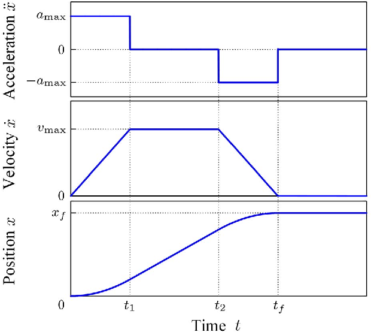

# Control Loop Standards

## Feedback and PID Control
### Key Terms:
* Process variable: The part of the robot being controlled. (ex. Arm position, gyro angle, etc).
* Setpoint: The desired value of the process variable.
* Output: The current value of the process variable.
* Error: setpoint - output, in other words, the difference between where the mechanism is and where it should be.

:::note
ALL EXAMPLE CODE IN THIS DOCUMENT USE WPILIB CLASSES TO IMPLEMENT CONTROL LOOPS. FOR ACTUAL HARDWARE, IT IS PREFERRED TO RUN CONTROL LOOPS ON THE MOTOR CONTROLLERS.
:::

### Feedback Control

Feedback control is a process by which the robot controls its mechanisms while referencing input data from its sensors. With most mechanisms, the goal is to reach the setpoint as fast and accurately as possible. In other words, it tries to reduce the error to 0.

### PID controllers 

The most common form of feedback control is a [PID controller](https://docs.wpilib.org/en/stable/docs/software/advanced-controls/introduction/introduction-to-pid.html#introduction-to-pid). PID controllers consist of 3 gains which influence the behavior of different parts of the mechanism.

[WPILib](https://github.com/wpilibsuite/allwpilib) has a built in [PID Controller class](https://docs.wpilib.org/en/stable/docs/software/advanced-controls/controllers/pidcontroller.html) that is used when implementing feedback control.

Example: PID controller to aim the robot at a target

```java
PIDController aimController =
        new PIDController(autoAimKP.get(), 0.0, autoAimKD.get(), Constants.LOOP_PERIOD_SECS);

aimController.enableContinuousInput(-Math.PI, Math.PI);
aimController.setTolerance(Units.degreesToRadians(1.0));


// ...


aimController.calculate(
    measuredGyroAngle.getRadians(),
    targetGyroAngle.get().getRadians())
```

The controller calculates the next control output which is used in the calculation of the robot's speed.

## Feedforward Control

In the previous example, the ```autoAimKI``` term is 0. The Ki term, or the integral term of a PID controller, corrects for [steady state error](https://www.sciencedirect.com/topics/engineering/steady-state-error) in the system, which is when the controller can't reach the setpoint.


The Integral term scales the output based on the total error over time. Meaning, as time progresses, if the output of the controller doesn't reach the setpoint, the Integral term will eventually rise to a value where the output reaches the setpoint.

The Integral term of a PID controller is rarely used because:
* It is reactive, meaning it reacts to the steady state error, slowing down the progression of the error to the setpoint.
* It is prone to [Integral Windup](https://en.wikipedia.org/wiki/Integral_windup), which is when the mechanism is somehow impeded from reaching the setpoint, which causes the Integral term to rise high enough to cause the output to be too fast.

When dealing with steady state error in FRC, most use a [Feedforward](https://en.wikipedia.org/wiki/Feed_forward_(control)), which predicts what the steady state error will be based on empircal measurements or theoretical system dynamics. In practice, this often means applying a constant output to a mechanism to overcome the force of gravity or static friction of the system.

WPILib has multiple [Feedforward classes](https://docs.wpilib.org/en/stable/docs/software/advanced-controls/controllers/feedforward.html) which are used for implementing Feedforward control.

## Combining Feedback and Feedforward control

When controlling a mechanism, it is often necessary to use both a Feedforward and Feedback controller to account for steady state error like gravity or static friction, while still controlling the mechanism to the setpoint. This is done by simply adding the PID controller output to the feedforward output.

Example: Feedforward and PID controller

```java
leftFeedback = new PIDController(KP.get(), 0.0, KD.get(), Constants.LOOP_PERIOD_SECS);
rightFeedback = new PIDController(KP.get(), 0.0, KD.get(), Constants.LOOP_PERIOD_SECS);

leftFeedforward = new SimpleMotorFeedforward(KS_LEFT.get(), KV_LEFT.get(), KA_LEFT.get());
rightFeedforward = new SimpleMotorFeedforward(KS_RIGHT.get(), KV_RIGHT.get(), KA_RIGHT.get());

// ...

leftFeedback.setSetpoint(leftSetpoint);
rightFeedback.setSetpoint(rightSetpoint);

io.setLeftVoltage(
    leftFeedforward.calculate(leftSetpoint) + leftFeedback.calculate(inputs.leftVelocityRadPerSec));
io.setRightVoltage(
    rightFeedforward.calculate(rightSetpoint)+ rightFeedback.calculate(inputs.rightVelocityRadPerSec));
```

## PID Control with Motion Profiling

In FRC, it is often necessary to limit the speed or acceleration of a mechanism. This can be done with a [Motion Profile](https://www.motioncontroltips.com/what-is-a-motion-profile/). Motion profiles use a set of parameters, such as max velocity and acceleration to generate a series of setpoints which a controller can follow. This serves to artificially limit the velocity and/or acceleration of a system.



WPILib has a [ProfiledPIDController class](https://docs.wpilib.org/en/stable/docs/software/advanced-controls/controllers/profiled-pidcontroller.html) which handles the setpoint generation automatically.

Example: Profiled PID controller

```java
ProfiledPIDController profiledFeedback =
        new ProfiledPIDController(
            KP.get(), 0.0, KD.get(), new Constraints(MAX_VELOCITY.get(), MAX_ACCELERATION.get()));


// ...


double position =
        MathUtil.clamp(positionRad + angleOffset, MIN_POSITION.get(), MAX_POSITION.get());

profiledFeedback.setGoal(position);
```

## Standards
The standards for control loops are as follows:
* All gains should be stored as a record of [```LoggedTunableNumber```](LOGGING_STANDARDS.md) objects in the appropriate subsystem's constants file.
    * Example:
    ```java
    public record Gains(
      LoggedTunableNumber kp,
      LoggedTunableNumber kd,
      LoggedTunableNumber ks,
      LoggedTunableNumber kg,
      LoggedTunableNumber kv) {}

    public record Constraints(
      LoggedTunableNumber maxVelocityRadiansPerSecond,
      LoggedTunableNumber maxAccelerationRadiansPerSecondSqaured,
      LoggedTunableNumber goalToleranceRadians) {}
    ```
    * Make sure to initialize defaults [appropriately](CONSTANTS_STANDARDS.md).
* For actual hardware, all control loops should be run onboard the motorcontroller. See Pheonix 6/Pro documentation for more details.
* For simulated hardware, all control loops should use WPILib classes.

## Tuning Controller Gains
Figuring out what the value of each gain should be can be challenging, but with a good tuning process, it can be done methodically.

### Manual Tuning
While tuning controllers manually, it is important to consider the units of the process variable. Consider an example of a single swerve wheel rotation controlled by raw voltage. The unit for the position of the wheel will be radians, and the unit for velocity is radians per second. Swerve wheel rotation works by wrapping the value of the rotation to between (-3.14, 3.14) radians, meaning the maximum error the wheel can experience is 3.14 radians from the setpoint. The maximum voltage the battery can supply a motor is 12 V. Armed with this information, it is plausible to estimate the order of magnitude that Kp and Kd should be.

#### PID Controller
1. Set Kd and Ki to 0.
2. Increase Kp from 0 by small increments until the mechanism starts oscillating around the setpoint.
3. Slowly increase Kd until the robot stops oscillating.

:::note
    * If the robot is jittery when tuning, reduce Kd
    * If the robot experiences steady state error, consider implementing a Feedforward.
    * A PID controller is tuned well if the output gets to the setpoint quickly without oscillating (green line):
    
:::

#### PID Controller with Motion Profile
1. Set Kp Ki and Kd to 0.
2. Set the maximum velocity and acceleration for the motion profile very low.
3. Tune the PID controller until the output tracks the setpoint well.
4. Continue this process by incrementing maximum velocity and acceleration and tuning PID until the maximum velocity and acceleration are reasonable.

* NOTES:
    * A motion profiled PID controller is tuned well when the output "tracks" the profile setpoints well. This means that the output should closely follow the shape of the motion profile.

### [SysID Tuning](https://docs.wpilib.org/en/stable/docs/software/advanced-controls/system-identification/introduction.html)
Fortunately, WPILib offers a relatively simple way of empirically measuring what the optimal feedforward gains should be. The SysID tutorial goes over what is needed to perform this task, however there are some standards to mention:

* ```SysIDRoutine``` code should be declared as a member variable of its subsystem:
    *  Example:
    ```java
    private final SysIdRoutine sysIdRoutine =
      new SysIdRoutine(
          new SysIdRoutine.Config(
              Volts.of(SubsystemConstants.RAMP_RATE_VOLTAGE)
                  .per(Seconds.of(SubsystemConstants.RAMP_RATE_SECONDS)),
              Volts.of(SubsystemConstants.STEP_VOLTAGE),
              Seconds.of(SubsystemConstants.SYSID_TIMEOUT),
              (state) -> Logger.recordOutput("Subsystem/SysID State", state.toString())),
          new SysIdRoutine.Mechanism((volts) -> setVoltage(volts.in(Volts)), null, this));
    ```
* The command to actually run SysID will be written as a command factory in the subsystem as follows:
    * Example:
    ```java
    public Command runSysId() {
        return Commands.sequence(
            sysIdRoutine.quasistatic(Direction.kForward),
            Commands.waitSeconds(SubsystemConstants.SYSID_DELAY),
            sysIdRoutine.quasistatic(Direction.kReverse),
            Commands.waitSeconds(SubsystemConstants.SYSID_DELAY),
            sysIdRoutine.dynamic(Direction.kForward),
            Commands.waitSeconds(SubsystemConstants.SYSID_DELAY),
            sysIdRoutine.dynamic(Direction.kReverse));
    }
    ```
* All SysID Commands should be added to the list of autonomous modes if the robot is in [Tuning Mode](LOGGING_STANDARDS.md)

Example: Autonomous chooser with shooter and drive characterization routines

```java
if (Constants.TUNING_MODE) {
      autoChooser.addOption("Shooter SysID", shooter.runSysId());
      autoChooser.addOption(
          "Drive Quasistatic Forward",
          DriveCommands.runSysIdQuasistatic(drive, Direction.kForward));
      autoChooser.addOption(
          "Drive Quasistatic Reverse",
          DriveCommands.runSysIdQuasistatic(drive, Direction.kReverse));
      autoChooser.addOption(
          "Drive Dynamic Forward", DriveCommands.runSysIdDynamic(drive, Direction.kForward));
      autoChooser.addOption(
          "Drive Dynamic Reverse", DriveCommands.runSysIdDynamic(drive, Direction.kReverse));
    }
```
